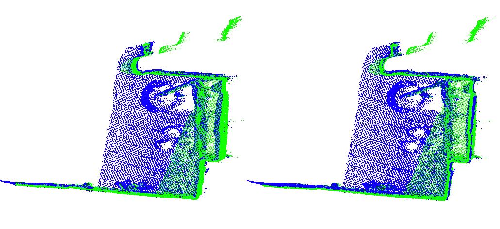

# C-RANSAC
[](https://opensource.org/licenses/MIT)

Probabilistic Self-UpdateLineVectorSet-BasedPointCloudRegistration (2025) by Kuo-Liang Chung and Yu-Cheng Lin.  

<div align=center>

</div>

The left figure is the testing point cloud "Redkitchen" selected from the [3DMATCH](https://3dmatch.cs.princeton.edu/) dataset, the green lines are inliers between the source point cloud and the target point cloud, and the red lines are outliers. The right one is the registration result using our method.

## Acknowledgments
The programing implementation of our method is based on:

[H. Yang](http://hankyang.mit.edu/), [J. Shi](http://jingnanshi.com/), and [L. Carlone](http://lucacarlone.mit.edu/), “TEASER: Fast and Certifiable Point Cloud Registration,” *IEEE Trans. Robotics*, Dec. 2020. ([IEEE](https://ieeexplore.ieee.org/document/9286491)) ([github](https://github.com/MIT-SPARK/TEASER-plusplus))

and

Chung, Kuo-Liang, and Wei-Tai Chang. "Centralized RANSAC Based Point Cloud Registration with Fast Convergence and High Accuracy." IEEE Journal of Selected Topics in Applied Earth Observations and Remote Sensing (2024).
([IEEE](https://ieeexplore.ieee.org/abstract/document/10433649)) ([github](https://github.com/ivpml84079/C-RANSAC/tree/master))

We appreciate the authors for sharing their codes.

## TEASER++ Modified

We have made modifications to the TEASER++ library to showcase our method. The modified code is located in the "registration.cc" file. Additionally, we utilize and modify the "teaser_cpp_ply.cc" file to "PSULVSB.cc" for conducting experiments.

## Usage
Compiling the codes of our method in the project directory
```
sudo apt install cmake libeigen3-dev libboost-all-dev
git clone https://github.com/tim970303/Probabilistic-Self-Update-Line-Vector-Set-Based-Point-Cloud-Registration.git
cd Probabilistic-Self-Update-Line-Vector-Set-Based-Point-Cloud-Registration/TEASER-plusplus && mkdir build && cd build
sudo cmake .. && sudo make && sudo make install && sudo ldconfig
cd .. && cd examples/teaser_cpp_ply && mkdir build && cd build
sudo cmake .. && sudo make
```
using the execution code to estimate the registration solution
```
./PSULVSB {PATH_TO_POINT_CLOUD}
```
## Testing enviroment
* Windows Subsystem Linux (Ubuntu 20.04.6 LTS)
* ISO C++ 17

## Contact
If you have any questions, please email us via   
Kuo-Liang Chung: klchung01@gmail.com
Yu-Cheng Lin: tim970303@gmail.com  "# Probabilistic_Self_Update_Line_Vector_Set_Based_Point_Cloud_Registration" 
